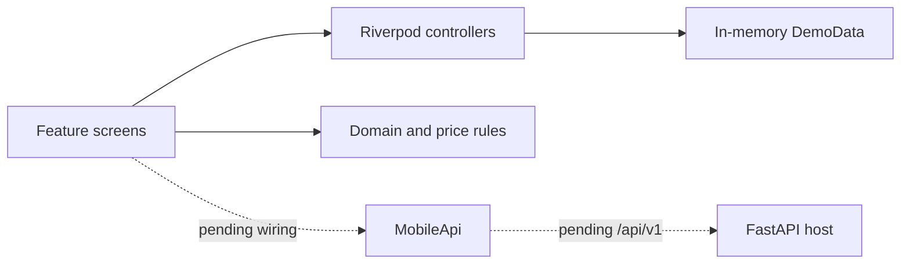

# Frontend architecture

## Scope

Receipts Hub is currently a frontend-only Android demo. The architecture keeps
visual behavior and price evidence rules testable while leaving a clear seam for
the existing FastAPI service. Camera and gallery acquisition use Android device
APIs; demo screens must not present simulated processing, OCR, stock, or
retailer data as a completed backend operation.

## Module boundaries

| Area | Responsibility | Current boundary |
| --- | --- | --- |
| `features/` | Screens and feature-local interaction state | Reads Riverpod providers and demo domain objects |
| `core/state/` | Process-lifetime application and theme state | `AppController`, `ThemeController`, and derived providers |
| `core/models/` | Receipt, merchant, pack, quote, and contribution types | Integer cents; immutable-by-convention inputs |
| `core/pricing/` | Item and basket comparisons | Returns explicit unavailable results for unsafe evidence |
| `core/data/` | Deterministic preview ledger | Temporary source; no persistence |
| `core/network/` | Dio and secure-token boundary | Session endpoint only; not connected to screens |
| `core/routing/` | Navigation graph and origin-aware return paths | GoRouter with shell and full-screen routes |
| `core/design/` | Theme tokens and shared interface components | Three colorways, two brightness modes |

Feature files are intentionally shallow during the demo milestone. When API
work begins, add repository interfaces and DTO mappers between providers and
`MobileApi`; do not make widgets parse JSON or depend directly on Dio.

## State model

`ProviderScope` wraps the application. `AppController` is a Riverpod
`Notifier<AppState>` and owns demo receipts, shopping entries, connection flags,
sharing, search/filter state, and ordered capture-page paths. `ThemeController` owns the
selected colorway and light/dark mode. Selectors limit broad rebuilds.

Receipt lookup is exposed through a family provider. Receipt drafts, processing
progress, and similar screen-lifetime values use feature-local auto-disposed
providers or local controllers. None of this state is persisted yet; restarting
the app restores `DemoData` and default Sage light.

Future repositories should expose asynchronous domain results through providers.
Secure storage should retain only the host address and session token—not receipt
or price-index content.

## Navigation

The router starts at `/welcome`.

Routes outside the bottom-navigation shell are:

- `/welcome` and `/connect`
- `/capture` and `/processing`
- `/receipts/:id/edit`
- `/photo?name=...`

Shell routes are:

- `/home`
- `/receipts` and `/receipts/:id`
- `/collections/:key`
- `/insights`, `/rivals`, and `/items/:name`
- `/list` and `/account`

The `from` query parameter preserves the origin of Collection, Rivals, and Item
details. Capture remains a central shell action but opens outside the shell so
the camera and processing surfaces can use the full viewport.

## Network boundary

`MobileApi` currently provides:

- `POST {server}/api/v1/session` with a household PIN.
- Typed `SessionEnvelope` and `ApiFailure` responses.
- Secure storage for `receipts_hub.server_url` and
  `receipts_hub.session_token`.
- Bearer authorization options and session clearing.

The connection screen does not call this class yet. It validates the URL and
PIN, updates in-memory state, and routes to Home. The FastAPI `/api/v1` contract,
health check, receipt upload, processing status, images, ledger, shopping,
insights, and settings endpoints remain pending.

Android cleartext access exists only for a trusted private LAN. A hosted or
remote phase must use HTTPS and must not rely on public port forwarding.

## Price evidence rules

These rules are domain constraints, not presentation preferences:

1. Thin or outlier crowd prices remain visible but cannot drive a verdict,
   range, crown, or savings label.
2. A savings verdict compares what the household paid with the lowest confirmed
   unit price in the active scope.
3. Ranges use confirmed evidence and comparable unit prices when packs differ.
4. The Best value crown follows the verdict winner, not the current sort index.
5. Only a confirmed, fileable receipt may contribute to the shared index.
6. Changing future sharing consent never rewrites historical contribution
   counts.
7. Every displayed price names its source and freshness.

The comparison layer also gates empty or unsorted history, invalid pack math,
inconsistent confidence metadata, empty confirmed pools, and incomplete basket
coverage. Ineligible input returns an unavailable result rather than throwing or
making a weak claim. Basket totals normalize pack multiples to the same requested
quantity before comparing merchants.

## Theme and interface system

Sage light is the default. Sage, Clay, and Olive each support light and dark
mode. `NotoSans` is the interface family; `Display` maps to the bundled Noto Sans
assets until a separate approved heading face exists.

The UI uses warm paper-like backgrounds, flat surfaces, semantic borders, and
minimal shadow. It has no gradients. Prices and totals use tabular numerals.
Core dimensions are a 24 px screen gutter, 16 px card padding, 20 px card radius,
44 px minimum target, and 56 px navigation/row height. The reference viewport is
390 x 844.

Theme selection is currently in memory. Persist it only through a settings
repository so UI code remains independent of the storage plugin.

## Verification gates

Before treating a frontend change as complete:

1. Run `flutter analyze` and fix every reported issue.
2. Run `flutter test` and `flutter test --coverage`.
3. Build with `flutter build apk --debug`.
4. Check the affected flow at 390 x 844 and with increased text scaling.
5. Check source labels, weak-data behavior, empty/loading/error states, semantic
   labels, and minimum targets.
6. On a device, distinguish real local camera/gallery acquisition from simulated
   upload/processing until `/api/v1` is connected and contract-tested.
